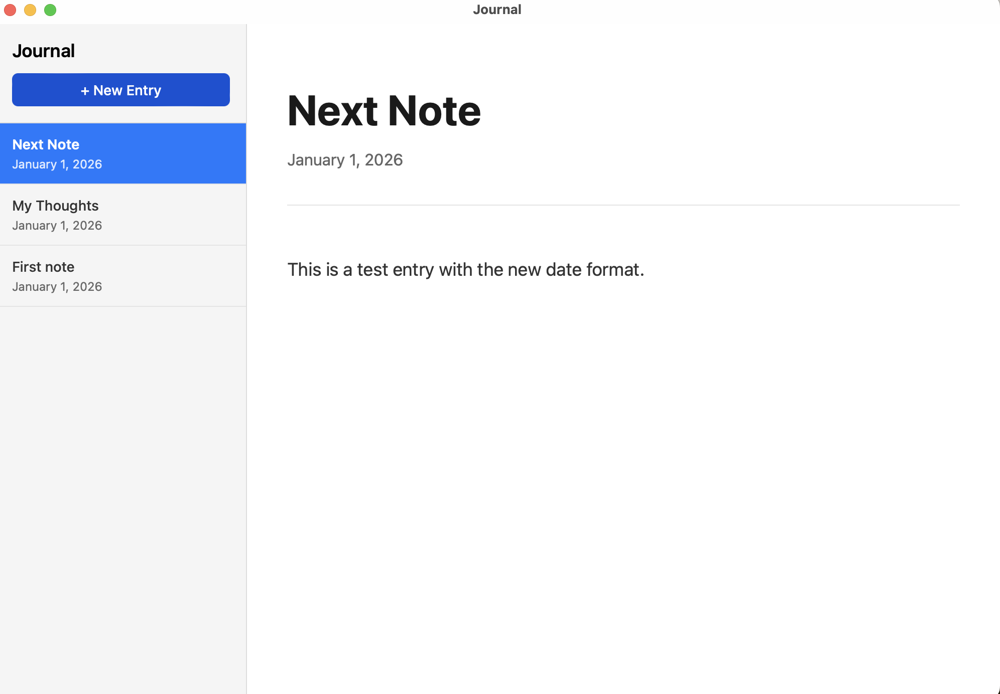

# Journal App - Complete Technical Documentation

## Project Overview

A privacy-first, fully local journaling application for macOS built with Tauri 2, React, and TypeScript. All journal entries are stored as plain markdown files with YAML frontmatter in the local file system.

**Version:** 1.0
**Platform:** macOS
**Tech Stack:** Tauri 2, React, TypeScript, Rust
**Data Storage:** Plain markdown files in `~/Documents/Project Data Files/Journal/`

## Screenshot



*The Journal App interface showing the sidebar with entries and the blog-style editor view.*

## Core Design Principles

1. **Privacy First:** All data stored locally, no cloud sync, no telemetry
2. **Future-Proof Storage:** Plain markdown files that can be read by any text editor
3. **Simplicity:** Minimal features for v1 - no encryption, no password, no Touch ID
4. **Blog-Style Interface:** Distraction-free writing experience with clean, centered layout
5. **Auto-Save:** Changes automatically saved with 1-second debounce

## Architecture

```
journal-app/
├── src/                          # React frontend
│   ├── App.tsx                   # Main application component
│   ├── App.css                   # Application styles
│   └── main.tsx                  # React entry point
├── src-tauri/                    # Rust backend
│   ├── src/
│   │   └── lib.rs                # Tauri commands and file operations
│   ├── Cargo.toml                # Rust dependencies
│   └── tauri.conf.json           # Tauri configuration
└── package.json                  # Node.js dependencies
```

## File Format Specification

### Journal Entry Structure

Each journal entry is a markdown file with YAML frontmatter:

```markdown
---
title: My Journal Entry
date: January 1, 2026
---

This is the content of my journal entry.
It can contain any markdown formatting.
```

### Filename Convention

- **With Title:** `{title}.md` (e.g., `My Journal Entry.md`)
- **Without Title:** `{date}.md` (e.g., `January 1, 2026.md`)

### Bidirectional Sync

- When title is edited → filename updates to match title
- When filename is renamed → title field updates to match filename
- Date field is always editable but doesn't affect filename if title exists

## Backend Implementation (Rust)

### File Location: `src-tauri/src/lib.rs`

### Dependencies (Cargo.toml)

```toml
[dependencies]
tauri = { version = "2", features = [] }
tauri-plugin-opener = "2"
tauri-plugin-fs = "2"
serde = { version = "1", features = ["derive"] }
serde_json = "1"
chrono = "0.4"
dirs = "5.0"
regex = "1"
```

### Data Structures

```rust
#[derive(Serialize, Deserialize)]
struct EntryInfo {
    filename: String,
    title: String,
    date: String,
}
```

### Core Functions

#### 1. `get_journal_dir() -> PathBuf`
Returns the journal directory path: `~/Documents/Project Data Files/Journal/`

```rust
fn get_journal_dir() -> PathBuf {
    let home = dirs::home_dir().expect("Could not find home directory");
    home.join("Documents").join("Project Data Files").join("Journal")
}
```

#### 2. `parse_frontmatter(content: &str) -> (String, String)`
Extracts title and date from YAML frontmatter using regex.

**Regex Patterns:**
- Frontmatter: `(?s)^---\n(.*?)\n---`
- Title: `(?m)^title:\s*(.*)$`
- Date: `(?m)^date:\s*(.*)$`

**Returns:** `(title, date)` tuple

#### 3. Tauri Commands

##### `list_entries() -> Result<Vec<EntryInfo>, String>`
- Scans journal directory for `.md` files
- Parses frontmatter from each file
- Sorts by date (newest first) using chrono::NaiveDate
- Fallback: sorts by filename if date parsing fails
- Creates directory if it doesn't exist

**Date Parsing Formats:**
- `%B %-d, %Y` (e.g., "January 1, 2026")
- `%B %d, %Y` (e.g., "January 01, 2026")

##### `read_entry(filename: String) -> Result<String, String>`
- Reads complete file content including frontmatter
- Returns raw markdown text

##### `save_entry(filename: String, content: String) -> Result<(), String>`
- Writes content to file
- Creates directory if needed

##### `create_entry() -> Result<String, String>`
- Generates filename from current date
- Creates file with initial frontmatter template
- Auto-populates date field
- Title field starts empty

**Template:**
```markdown
---
title:
date: {current_date}
---

```

##### `update_entry_metadata(filename: String, title: String, date: String, content: String) -> Result<String, String>`
- Updates file content with new frontmatter
- Determines new filename based on title/date
- Renames file if needed
- Prevents overwriting existing files
- Returns new filename

**Filename Logic:**
```rust
let new_filename = if title.trim().is_empty() {
    format!("{}.md", date)
} else {
    format!("{}.md", title.trim())
};
```

##### `rename_entry(old_filename: String, new_filename: String) -> Result<(), String>`
- Renames file in journal directory
- Ensures `.md` extension
- Validates file existence
- Prevents name conflicts

##### `delete_entry(filename: String) -> Result<(), String>`
- Deletes specified journal entry
- Validates file exists before deletion
- Returns error if file not found

### Command Registration

```rust
.invoke_handler(tauri::generate_handler![
    list_entries,
    read_entry,
    save_entry,
    create_entry,
    rename_entry,
    update_entry_metadata,
    delete_entry
])
```

## Frontend Implementation (React + TypeScript)

### File Location: `src/App.tsx`

### Interfaces

```typescript
interface EntryMetadata {
  title: string;
  date: string;
  content: string;
}

interface EntryInfo {
  filename: string;
  title: string;
  date: string;
}
```

### State Management

```typescript
const [entries, setEntries] = useState<EntryInfo[]>([]);
const [selectedEntry, setSelectedEntry] = useState<string | null>(null);
const [title, setTitle] = useState<string>("");
const [date, setDate] = useState<string>("");
const [content, setContent] = useState<string>("");
const [isSaving, setIsSaving] = useState(false);
const [deleteConfirm, setDeleteConfirm] = useState<string | null>(null); // Filename pending deletion
```

### Core Functions

#### `parseFrontmatter(text: string): EntryMetadata`
Client-side frontmatter parser that extracts title, date, and content.

**Regex:** `/^---\n([\s\S]*?)\n---\n([\s\S]*)$/`

**Returns:**
- `title`: Extracted from frontmatter or empty string
- `date`: Extracted from frontmatter or empty string
- `content`: Everything after frontmatter block

#### `loadEntries()`
- Calls `list_entries` Tauri command
- Updates `entries` state
- Handles errors silently (logs to console)

#### `loadEntry(filename: string)`
- Calls `read_entry` Tauri command
- Parses frontmatter
- Updates title, date, content states
- Sets selected entry

#### `saveEntry()`
- Debounced auto-save function (1000ms delay)
- Calls `update_entry_metadata` Tauri command
- Handles filename changes
- Reloads entry list if filename changed
- Shows saving indicator

**Implementation:**
```typescript
const saveEntry = useCallback(async () => {
  if (!selectedEntry) return;

  setIsSaving(true);
  try {
    const newFilename = await invoke<string>("update_entry_metadata", {
      filename: selectedEntry,
      title: title,
      date: date,
      content: content,
    });

    if (newFilename !== selectedEntry) {
      setSelectedEntry(newFilename);
      await loadEntries();
    }
  } catch (error) {
    console.error("Failed to save entry:", error);
  } finally {
    setIsSaving(false);
  }
}, [selectedEntry, title, date, content]);
```

#### Auto-Save Effect

```typescript
useEffect(() => {
  if (!selectedEntry) return;

  const timeout = setTimeout(() => {
    saveEntry();
  }, 1000);

  return () => clearTimeout(timeout);
}, [title, date, content, selectedEntry, saveEntry]);
```

#### `createNewEntry()`
- Calls `create_entry` Tauri command
- Reloads entry list
- Automatically opens new entry

#### Delete Functions

The delete functionality uses a custom React modal instead of the native `confirm()` dialog, as browser dialogs don't work in Tauri's webview.

##### `handleDeleteClick(filename: string, e: React.MouseEvent)`
- Prevents event bubbling with `e.stopPropagation()`
- Sets `deleteConfirm` state to trigger modal display

##### `confirmDelete()`
- Calls `delete_entry` Tauri command with pending filename
- Clears selection if deleted entry was active
- Reloads entry list
- Closes modal by clearing `deleteConfirm` state

##### `cancelDelete()`
- Closes modal by clearing `deleteConfirm` state
- Entry remains unchanged

### UI Components

#### Layout Structure

```
app (flexbox container)
├── sidebar
│   ├── sidebar-header
│   │   ├── h1 (Journal)
│   │   └── new-entry-btn
│   └── entry-list
│       └── entry-item (multiple)
│           ├── entry-item-content
│           │   ├── entry-item-title
│           │   └── entry-item-date
│           └── delete-btn (trash icon SVG)
├── editor-container
│   └── blog-view
│       ├── blog-header
│       │   ├── blog-title (input)
│       │   ├── blog-date (input)
│       │   └── saving-indicator
│       └── blog-content
│           └── blog-editor (textarea)
└── modal-overlay (conditional)
    └── modal
        ├── modal-icon (trash SVG)
        ├── modal-title
        ├── modal-message
        └── modal-buttons
            ├── modal-btn-cancel
            └── modal-btn-delete
```

#### Sidebar Entry Component

```typescript
<div
  key={entry.filename}
  className={`entry-item ${selectedEntry === entry.filename ? "active" : ""}`}
  onClick={() => handleEntryClick(entry.filename)}
>
  <div className="entry-item-content">
    <div className="entry-item-title">
      {entry.title || entry.date || entry.filename.replace(/\.md$/, "")}
    </div>
    {entry.date && (
      <div className="entry-item-date">{entry.date}</div>
    )}
  </div>
  <button
    className="delete-btn"
    onClick={(e) => handleDeleteClick(entry.filename, e)}
    title="Delete entry"
  >
    <svg width="16" height="16" viewBox="0 0 24 24" fill="none" stroke="currentColor" strokeWidth="2">
      <polyline points="3 6 5 6 21 6"></polyline>
      <path d="M19 6v14a2 2 0 0 1-2 2H7a2 2 0 0 1-2-2V6m3 0V4a2 2 0 0 1 2-2h4a2 2 0 0 1 2 2v2"></path>
      <line x1="10" y1="11" x2="10" y2="17"></line>
      <line x1="14" y1="11" x2="14" y2="17"></line>
    </svg>
  </button>
</div>
```

**Display Logic:**
- Primary: Show title if exists
- Fallback 1: Show date if title is empty
- Fallback 2: Show filename without `.md` extension

#### Editor Component

```typescript
<div className="blog-view">
  <div className="blog-header">
    <input
      type="text"
      className="blog-title"
      value={title}
      onChange={handleTitleChange}
      placeholder="Untitled"
    />
    <input
      type="text"
      className="blog-date"
      value={date}
      onChange={handleDateChange}
      placeholder="Date"
    />
    {isSaving && <div className="saving-indicator">Saving...</div>}
  </div>
  <div className="blog-content">
    <textarea
      className="blog-editor"
      value={content}
      onChange={handleContentChange}
      placeholder="Start writing your thoughts..."
    />
  </div>
</div>
```

#### Delete Confirmation Modal

A custom React modal replaces the native browser `confirm()` dialog (which doesn't work in Tauri's webview).

```typescript
{deleteConfirm && (
  <div className="modal-overlay" onClick={cancelDelete}>
    <div className="modal" onClick={(e) => e.stopPropagation()}>
      <div className="modal-icon">
        <svg width="48" height="48" viewBox="0 0 24 24" fill="none" stroke="#ff3b30" strokeWidth="2">
          <polyline points="3 6 5 6 21 6"></polyline>
          <path d="M19 6v14a2 2 0 0 1-2 2H7a2 2 0 0 1-2-2V6m3 0V4a2 2 0 0 1 2-2h4a2 2 0 0 1 2 2v2"></path>
        </svg>
      </div>
      <h2 className="modal-title">Delete Entry?</h2>
      <p className="modal-message">
        Are you sure you want to delete this entry? This action cannot be undone.
      </p>
      <div className="modal-buttons">
        <button className="modal-btn modal-btn-cancel" onClick={cancelDelete}>
          Cancel
        </button>
        <button className="modal-btn modal-btn-delete" onClick={confirmDelete}>
          Delete
        </button>
      </div>
    </div>
  </div>
)}
```

**Modal Features:**
- Semi-transparent overlay backdrop
- Click outside modal to cancel
- Trash icon in danger color (red)
- Clear warning message
- Cancel and Delete buttons
- Delete button styled in danger color

## Styling (CSS)

### File Location: `src/App.css`

### Design System

**Colors:**
- Primary: `#007aff` (macOS blue)
- Primary Hover: `#0051d5`
- Danger: `#ff3b30` (macOS red)
- Background: `#fafafa`
- Sidebar: `#f5f5f5`
- Text: `#333`, `#666`, `#999`
- Borders: `#ddd`, `#e5e5e5`

**Typography:**
- Font Family: `-apple-system, BlinkMacSystemFont, 'Segoe UI', ...`
- Title: 42px, weight 700
- Date: 16px, weight 400
- Body: 18px, line-height 1.8
- Sidebar Title: 14px
- Sidebar Date: 12px

### Key Layout Rules

#### App Container
```css
.app {
  display: flex;
  height: 100vh;
  overflow: hidden;
}
```

#### Sidebar
```css
.sidebar {
  width: 250px;
  background-color: #f5f5f5;
  border-right: 1px solid #ddd;
  display: flex;
  flex-direction: column;
}

.entry-list {
  flex: 1;
  overflow-y: auto;  /* Automatic scrolling */
}
```

#### Entry Item States

**Default:**
```css
.entry-item {
  padding: 12px 16px;
  cursor: pointer;
  border-bottom: 1px solid #e5e5e5;
  transition: all 0.2s;
  display: flex;
  align-items: flex-start;
  justify-content: space-between;
  gap: 8px;
}
```

**Hover:**
```css
.entry-item:hover {
  background-color: #e8e8e8;
}
```

**Active (Selected):**
```css
.entry-item.active {
  background-color: #007aff;
  border-left: 3px solid #0051d5;
  padding-left: 13px;
}

.entry-item.active .entry-item-title {
  color: white;
  font-weight: 600;
}

.entry-item.active .entry-item-date {
  color: rgba(255, 255, 255, 0.85);
}
```

#### Delete Button

Uses an SVG trash icon instead of text character for better visual consistency.

**Hidden by Default:**
```css
.delete-btn {
  background: transparent;
  border: none;
  color: #999;
  cursor: pointer;
  padding: 4px;
  width: 28px;
  height: 28px;
  display: flex;
  align-items: center;
  justify-content: center;
  border-radius: 4px;
  opacity: 0;  /* Hidden until hover */
  transition: all 0.2s;
  position: relative;
  z-index: 10;
  pointer-events: auto;
}
```

**Show on Hover:**
```css
.entry-item:hover .delete-btn {
  opacity: 1;
}

.delete-btn:hover {
  background-color: #ff3b30;
  color: white;
}
```

**Active Entry Delete Button:**
```css
.entry-item.active .delete-btn {
  color: white;
}

.entry-item.active .delete-btn:hover {
  background-color: rgba(255, 255, 255, 0.2);
}
```

#### Blog View (Editor)

**Container:**
```css
.blog-view {
  max-width: 800px;
  width: 100%;
  margin: 0 auto;  /* Centered */
  padding: 60px 40px;
  background-color: white;
  min-height: 100%;
}
```

**Title Input:**
```css
.blog-title {
  width: 100%;
  border: none;
  outline: none;
  font-size: 42px;
  font-weight: 700;
  line-height: 1.2;
  margin-bottom: 16px;
  color: #1a1a1a;
  background: transparent;
}
```

**Date Input:**
```css
.blog-date {
  width: 100%;
  border: none;
  outline: none;
  font-size: 16px;
  font-weight: 400;
  color: #666;
  background: transparent;
  margin-bottom: 12px;
}
```

**Content Editor:**
```css
.blog-editor {
  width: 100%;
  min-height: 500px;
  border: none;
  outline: none;
  font-size: 18px;
  line-height: 1.8;
  color: #333;
  resize: none;
  background: transparent;
}
```

### Text Truncation

```css
.entry-item-title,
.entry-item-date {
  white-space: nowrap;
  overflow: hidden;
  text-overflow: ellipsis;
}
```

### Delete Confirmation Modal

```css
.modal-overlay {
  position: fixed;
  top: 0;
  left: 0;
  right: 0;
  bottom: 0;
  background-color: rgba(0, 0, 0, 0.5);
  display: flex;
  align-items: center;
  justify-content: center;
  z-index: 1000;
}

.modal {
  background: white;
  border-radius: 12px;
  padding: 32px;
  max-width: 400px;
  width: 90%;
  text-align: center;
  box-shadow: 0 20px 60px rgba(0, 0, 0, 0.3);
}

.modal-icon {
  margin-bottom: 16px;
}

.modal-title {
  font-size: 20px;
  font-weight: 600;
  color: #1a1a1a;
  margin-bottom: 8px;
}

.modal-message {
  font-size: 14px;
  color: #666;
  margin-bottom: 24px;
  line-height: 1.5;
}

.modal-buttons {
  display: flex;
  gap: 12px;
  justify-content: center;
}

.modal-btn {
  padding: 10px 24px;
  border-radius: 8px;
  font-size: 14px;
  font-weight: 500;
  cursor: pointer;
  transition: all 0.2s;
  border: none;
}

.modal-btn-cancel {
  background-color: #e5e5e5;
  color: #333;
}

.modal-btn-cancel:hover {
  background-color: #d5d5d5;
}

.modal-btn-delete {
  background-color: #ff3b30;
  color: white;
}

.modal-btn-delete:hover {
  background-color: #e0352b;
}
```

## Build Instructions

### Prerequisites

1. **Node.js**: Version 20.19+ or 22.12+ (Vite requirement)
2. **Rust**: Install via `curl --proto '=https' --tlsv1.2 -sSf https://sh.rustup.rs | sh`
3. **Tauri CLI**: Installed via npm (included in dependencies)

### Initial Setup

```bash
# Clone or create project directory
mkdir journal-app
cd journal-app

# Initialize Tauri project
npm create tauri-app@latest

# Project setup answers:
# - Project name: journal-app
# - Package manager: npm
# - UI template: React + TypeScript
# - Add Vite plugin: Yes
```

### Install Dependencies

```bash
# Frontend dependencies
npm install

# Tauri plugins (add to src-tauri/Cargo.toml)
# Already specified in Cargo.toml dependencies section

# Additional Rust dependencies
cd src-tauri
cargo add chrono dirs regex
cd ..
```

### Project Configuration

#### Update `package.json`

```json
{
  "name": "journal-app",
  "private": true,
  "version": "0.1.0",
  "type": "module",
  "scripts": {
    "dev": "vite",
    "build": "tsc && vite build",
    "preview": "vite preview",
    "tauri": "tauri"
  },
  "dependencies": {
    "@tauri-apps/api": "^2",
    "@tauri-apps/plugin-opener": "^2",
    "react": "^19.1.0",
    "react-dom": "^19.1.0"
  },
  "devDependencies": {
    "@tauri-apps/cli": "^2",
    "@types/react": "^19.1.0",
    "@types/react-dom": "^19.1.0",
    "@vitejs/plugin-react": "^4.6.0",
    "typescript": "~5.8.3",
    "vite": "^7.0.4"
  }
}
```

#### Update `src-tauri/Cargo.toml`

```toml
[package]
name = "journal-app"
version = "0.1.0"
description = "A Tauri App"
authors = ["you"]
edition = "2021"

[lib]
name = "journal_app_lib"
crate-type = ["staticlib", "cdylib", "rlib"]

[build-dependencies]
tauri-build = { version = "2", features = [] }

[dependencies]
tauri = { version = "2", features = [] }
tauri-plugin-opener = "2"
tauri-plugin-fs = "2"
serde = { version = "1", features = ["derive"] }
serde_json = "1"
chrono = "0.4"
dirs = "5.0"
regex = "1"
```

### Development Workflow

```bash
# Start development server
npm run tauri dev

# Build for production
npm run tauri build

# Clean Rust build artifacts (if needed)
cd src-tauri && cargo clean && cd ..
```

### Important Notes

1. **Hot Reload**: Frontend changes auto-reload, but Rust changes require app restart
2. **New Tauri Commands**: Always restart the app after adding new `#[tauri::command]` functions
3. **Data Directory**: Created automatically at `~/Documents/Project Data Files/Journal/`
4. **Permissions**: Tauri 2 uses filesystem plugin for file access (already configured)

## User Workflows

### Creating a New Entry

1. Click "+ New Entry" button
2. File created with current date in frontmatter
3. Entry opens in editor
4. Start typing in title, date, or content fields
5. Auto-saves after 1 second of inactivity
6. Filename updates based on title/date

### Editing an Entry

1. Click entry in sidebar
2. Entry loads with title, date, content
3. Edit any field
4. Changes auto-save after 1 second
5. "Saving..." indicator appears during save
6. Filename updates if title changes

### Deleting an Entry

1. Hover over entry in sidebar
2. Trash icon button appears on the right
3. Click trash icon
4. Confirmation modal appears with:
   - Trash icon in red
   - "Delete Entry?" title
   - Warning: "This action cannot be undone"
   - Cancel and Delete buttons
5. Click Delete to confirm (or Cancel to abort)
6. Entry removed from sidebar and filesystem
7. If deleted entry was open, editor clears to empty state
8. Click outside modal also cancels deletion

### Organizing Entries

- Entries automatically sorted by date (newest first)
- Entries without valid dates sorted by filename
- Scroll sidebar when entries exceed viewport

## Error Handling

### Backend Errors

All Tauri commands return `Result<T, String>`:

```rust
// Success
Ok(value)

// Error with message
Err("Error description".to_string())
```

### Frontend Error Handling

```typescript
try {
  await invoke("command_name", { params });
} catch (error) {
  console.error("Operation failed:", error);
  // Some operations also show alert() to user
}
```

### Common Issues and Solutions

**Issue:** Rust command not found
**Solution:** Restart app after adding new commands

**Issue:** Build artifacts from old location
**Solution:** Run `cargo clean` in src-tauri directory

**Issue:** Vite Node.js version warning
**Solution:** Upgrade to Node.js 20.19+ or 22.12+

**Issue:** File already exists error
**Solution:** Change title to unique value

**Issue:** Date sorting not working
**Solution:** Use format "Month Day, Year" (e.g., "January 1, 2026")

**Issue:** Native browser dialogs (confirm, alert, prompt) don't work
**Solution:** Use custom React modals instead (Tauri webview doesn't support native dialogs)

## Testing Checklist

### Basic Functionality
- [ ] Create new entry
- [ ] Entry appears in sidebar with date
- [ ] Edit title and verify filename changes
- [ ] Edit date field
- [ ] Edit content
- [ ] Verify auto-save after 1 second
- [ ] Close and reopen app - changes persisted
- [ ] Create multiple entries
- [ ] Verify newest entries appear first

### Delete Functionality
- [ ] Hover over entry shows trash icon button
- [ ] Click trash icon shows confirmation modal
- [ ] Modal displays trash icon, title, warning message
- [ ] Cancel button closes modal, keeps entry
- [ ] Click outside modal closes it, keeps entry
- [ ] Delete button removes entry
- [ ] Deleting active entry clears editor
- [ ] Deleting inactive entry keeps editor open
- [ ] Deleted file removed from filesystem

### Edge Cases
- [ ] Create entry with no title (uses date as filename)
- [ ] Create entry with title (uses title as filename)
- [ ] Change from titled to untitled
- [ ] Change from untitled to titled
- [ ] Enter duplicate title (should error)
- [ ] Special characters in title
- [ ] Very long title
- [ ] Empty content saves correctly
- [ ] Rapid typing triggers single save (debounced)

### UI/UX
- [ ] Sidebar scrolls with many entries
- [ ] Active entry highlighted in blue
- [ ] Trash icon hidden until hover
- [ ] Trash icon visible on active entry (white)
- [ ] Delete modal centered with overlay
- [ ] Delete modal has proper styling
- [ ] Title input borderless and seamless
- [ ] Content area centered at 800px
- [ ] Placeholder text visible when empty
- [ ] Saving indicator appears during save

## Future Enhancements (Not in V1)

1. **Security**: Touch ID, encryption, password protection
2. **Search**: Full-text search across entries
3. **Tags**: Categorization and filtering
4. **Export**: Bulk export to PDF, HTML
5. **Themes**: Dark mode support
6. **Markdown**: Live preview with formatting
7. **Attachments**: Embed images and files
8. **Cloud Sync**: Optional iCloud/Dropbox sync
9. **Templates**: Pre-defined entry templates
10. **Calendar**: Date-based navigation

## File System Details

### Directory Structure

```
~/Documents/Project Data Files/Journal/
├── January 1, 2026.md
├── My First Entry.md
├── Weekend Thoughts.md
└── December 31, 2025.md
```

### File Permissions

Files created with default user permissions (readable/writable by user only).

### Backup Recommendation

Since files are plain markdown, users can backup by:
1. Time Machine (automatic macOS backup)
2. Copy folder to external drive
3. Cloud sync via Dropbox/iCloud (manual)
4. Git repository (for version control)

## API Reference

### Tauri Commands (Rust → TypeScript)

```typescript
// List all entries with metadata
invoke<EntryInfo[]>("list_entries")

// Read specific entry content
invoke<string>("read_entry", { filename: "Entry.md" })

// Save entry (legacy - prefer update_entry_metadata)
invoke<void>("save_entry", {
  filename: "Entry.md",
  content: "---\ntitle: ...\n---\n..."
})

// Create new entry
invoke<string>("create_entry")

// Update entry with metadata sync
invoke<string>("update_entry_metadata", {
  filename: "Old.md",
  title: "New Title",
  date: "January 1, 2026",
  content: "Content here"
})

// Rename entry
invoke<void>("rename_entry", {
  old_filename: "Old.md",
  new_filename: "New.md"
})

// Delete entry
invoke<void>("delete_entry", { filename: "Entry.md" })
```

## Deployment

### macOS App Bundle

```bash
# Build production app
npm run tauri build

# Output location
src-tauri/target/release/bundle/macos/journal-app.app
```

### Distribution Options

1. **Direct Distribution**: Share .app bundle
2. **DMG**: Create disk image for installation
3. **Mac App Store**: Requires Apple Developer account and code signing
4. **Homebrew**: Create formula for package manager installation

### Code Signing (Future)

For distribution outside Mac App Store:
1. Obtain Apple Developer certificate
2. Configure in tauri.conf.json
3. Notarize app with Apple

## Development Tips

### Debugging

**Frontend:**
- Open DevTools in app window
- Use `console.log()` for debugging
- React DevTools available

**Backend:**
- Use `println!()` or `eprintln!()` in Rust
- Output appears in terminal running `npm run tauri dev`
- Use `dbg!()` macro for variable inspection

### Performance

- Auto-save debounce prevents excessive writes
- Frontmatter parsing cached in `list_entries`
- Minimal re-renders with proper React hooks

### Best Practices

1. Always validate file existence before operations
2. Use `Result<T, String>` for error handling
3. Sanitize filenames (no special chars except in content)
4. Test with large numbers of entries (100+)
5. Test with very long content (10,000+ words)

## Version History

### v1.0 (Current)
- Initial release
- Core journaling functionality
- Blog-style editor
- Delete functionality with confirmation
- Auto-save
- Date-based sorting

## Credits

Built with:
- Tauri 2: Desktop app framework
- React 19: UI library
- TypeScript: Type safety
- Rust: Backend logic
- Vite 7: Build tool
- chrono: Date parsing
- regex: Frontmatter parsing

## License

Private project - all rights reserved.

---

**End of Documentation**

This documentation is designed to be comprehensive enough for any AI coding agent (Claude Code, Cursor, etc.) to rebuild the project from scratch or make modifications while maintaining consistency with the original design.
